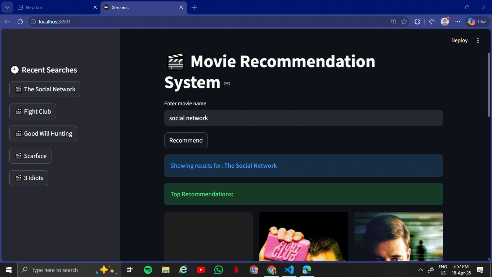

# 🎬 Movie Recommendation System

A **content-based movie recommendation system** built using **Python, Streamlit, and Machine Learning**.

This project recommends similar movies based on **genre, director, and cast information** using **CountVectorizer** and **Cosine Similarity**.

It also includes:

* 🎥 Movie poster fetching using TMDB API
* 🔍 Fuzzy movie title matching
* 🕘 Recent search history
* 📱 Clean Streamlit user interface

⚠️ **Important:**
This project uses the **IMDb Top 1000 Movies Dataset**, so recommendations are limited to these **1000 movies only**.

It does **not include all movies from IMDb or the internet**.

---

## 🚀 Features

* Recommend top **9 similar movies**
* Handle **misspelled movie names** using fuzzy matching
* Display movie posters with TMDB API
* Show recent searches in sidebar
* Fast recommendations using cosine similarity
* Clean and responsive Streamlit UI

---

## 📊 Dataset Information

This project is based on the **IMDb Top 1000 Movies Dataset**.

The dataset contains only the **top 1000 highest-rated/popular movies from IMDb**.

Because of this, the system can recommend movies **only from these 1000 titles**.

If a movie is not present in the dataset, it may not be found.

### Dataset Columns Used

* `Series_Title`
* `Genre`
* `Director`
* `Star1`
* `Star2`
* `Star3`

---

## 🛠️ Tech Stack

* **Python**
* **Streamlit**
* **Pandas**
* **Scikit-learn**
* **Requests**
* **TMDB API**

---

## 🧠 How It Works

This project uses a **content-based filtering approach**.

### 1) Data Preprocessing

Important movie features such as:

* Genre
* Director
* Cast

are combined into a single **tag column**.

Example:

```python
tag = Genre + Director + Star1 + Star2 + Star3
```

---

### 2) Text Vectorization

The text tags are converted into numerical vectors using:

```python
CountVectorizer()
```

---

### 3) Similarity Matching

Cosine similarity is used to compare movie vectors.

```python
cosine_similarity(vectors)
```

Movies with the highest similarity score are recommended.

---

### 4) Fuzzy Search

The app uses fuzzy matching to handle spelling mistakes.

Example:

```text
avngers → avengers
```

This improves user experience and search flexibility.

---

## 📂 Project Structure

```text
movie-recommendation-system-streamlit/
│
├── app.py
├── data.csv
├── requirements.txt
└── README.md
```

---

## ⚙️ Installation & Setup

Clone the repository:

```bash
git clone https://github.com/your-username/movie-recommendation-system-streamlit.git
cd movie-recommendation-system-streamlit
```

Install dependencies:

```bash
pip install -r requirements.txt
```

Run the app:

```bash
streamlit run app.py
```

---

## 🔑 TMDB API Setup

Get your API key from The Movie Database.

Store it securely using Streamlit secrets or environment variables.

Example:

```toml
TMDB_API_KEY = "your_api_key_here"
```

---

## 📸 Preview

Add your project screenshot here after deployment.

Example:

```markdown
[](https://github.com/krishna-srivastava/movie-recommendation-system-streamlit/blob/main/screenshot.png)
```

---

## 🎯 Future Improvements

* Add movie overview / plot summary
* Include IMDb ratings in recommendations
* Add genre-based filtering
* Improve recommendation accuracy
* Deploy on Streamlit Cloud
* Expand dataset beyond top 1000 movies

---

## 👨‍💻 Author

Made with ❤️ by **Krishna**
